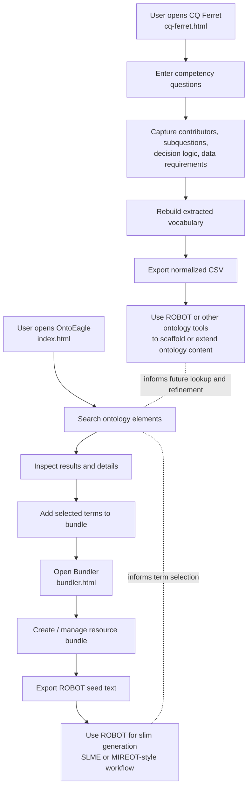

# OntoEagle Repository Overview

A lightweight browser-based toolkit for **exploring ontologies**, **assembling ontology slims**, and **gathering competency questions** for ontology development.

---

## What this repository is for

This repository has three main user-facing pages:

- **`index.html` — OntoEagle**  
  The main search experience. Use it to quickly look up ontology elements across a large ontology collection, filter results, inspect term details, and add selected terms into a bundle for later export.

- **`bundler.html` — Bundler / Slim Builder**  
  A helper app for building ontology “slims.” Think of it like a shopping cart for ontology terms. After selecting terms in OntoEagle, you can manage the bundle here and export a **ROBOT seed file** for workflows such as **SLME** or **MIREOT**.

- **`cq-ferret.html` — CQ Ferret**  
  A competency-question app for ontology development. It captures questions and supporting metadata, and it can generate a prioritized vocabulary list from the wording of the questions. That vocabulary can be exported as normalized CSV for ROBOT or other ontology tools.

---

## Quick start

If you fork this repository, the simplest path is:

1. **Fork the repo**
2. **Add your custom ontologies** to:
   ```text
   $project_root/src/ontologies
   ```

## License

This project is licensed under the GNU General Public License version 3.0. See [LICENSE](LICENSE) for the full license text.


# Workflow w/ OntoEagle and CQ Ferret


