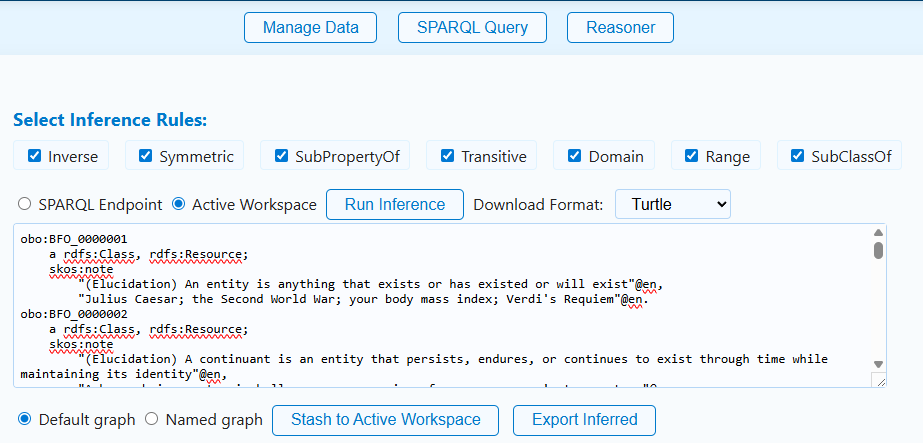
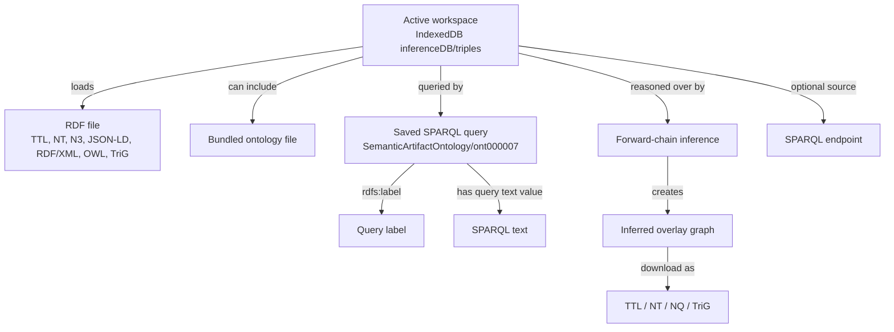

# Axiolotl Tutorial: Load RDF, Query It, Save Queries, and Materialize Inferences


## BLUF

[Axiolotl](https://jonathanvajda.github.io/axiolotl/) helps ontology developers move from scattered RDF files, ad hoc SPARQL snippets, and unavailable graph-database infrastructure into a browser-based staging workflow. The payoff is practical: users can load RDF into a local active workspace, query it with SPARQL, save reusable queries, run lightweight forward-chain inference, and export query or inferred-output artifacts for downstream ontology, graph-database, or DevOps work.

This tutorial focuses only on the deployed [Axiolotl](https://jonathanvajda.github.io/axiolotl/) page and the browser code that supports its data, query, storage, and inference behavior.

## Table of Contents

1. [The Problem Axiolotl Solves](#the-problem-axiolotl-solves)
2. [Worked Scenario](#worked-scenario)
3. [Open the App](#open-the-app)
4. [Create or Import Data](#create-or-import-data)
5. [Query the Active Workspace](#query-the-active-workspace)
6. [Save and Reuse Queries](#save-and-reuse-queries)
7. [Run Inference](#run-inference)
8. [Export or Reuse the Data](#export-or-reuse-the-data)
9. [Design Pattern Notes](#design-pattern-notes)
10. [Screenshot Checklist](#screenshot-checklist)
11. [Frequently Asked Questions](#frequently-asked-questions)

## The Problem Axiolotl Solves

Before: ontology developers often test RDF and SPARQL across local files, email attachments, restricted servers, partial database access, or one-off scripts. This works for a first check, but breaks down when the project needs to search, normalize, validate, reuse, export, or share the evidence behind a query result.

After: Axiolotl lets users stage RDF in a browser-local active workspace, run SPARQL against that workspace or a configured endpoint, save useful queries, and materialize selected implicit triples. It is useful when a team needs some lightweight ROBOT-like checking or graph-database behavior, but cannot easily stand up Jena Fuseki, GraphDB, or another server inside a sensitive environment.

The key problem dimensions are:

- Findability: saved queries remain visible in the app instead of living only in personal notes.
- Normalization: saved queries use a normalized CSV and JSON-LD shape.
- Coordination across roles: ontologists, data engineers, and reviewers can exchange RDF files and query files.
- Import/export: RDF files can be loaded, saved queries can be imported/exported, and inferred output can be downloaded.
- Traceability: query labels and IRIs preserve which reusable query artifact was used.
- Data quality and validation: local SPARQL checks can reveal missing labels, unexpected classes, or unmaterialized relationships.
- Reuse: exported query artifacts and inferred RDF can move into graph databases, CI checks, ontology-review workflows, or issue tickets.

> Design note: A saved SPARQL query is treated as a semantic artifact, not just text in a textarea. The app stores it with an IRI, label, class IRI, and query-text predicate so it can be exported as CSV or JSON-LD.

## Worked Scenario

This tutorial uses a fleet maintenance and depot-readiness scenario. It is generic enough for manufacturing, logistics, public works, defense, energy, healthcare operations, or any organization that coordinates physical assets, facilities, parts, and service events.

The use-case data is about vehicles, depots, service activities, and parts.

The app data is about RDF files loaded into the active workspace, SPARQL queries, saved-query records, inferred triples, local settings, and exported artifacts.

Main example task:

```text
Find vehicles that have scheduled service, identify the depot they are assigned to, and verify whether inference can materialize the inverse depot-to-vehicle relationship.
```

This is a realistic ontology-development task because the asserted data and the axioms may be split across systems. A source system may assert `ex:assignedToDepot`, while a reviewer expects to query `ex:hasAssignedVehicle`. Axiolotl gives the developer a quick way to stage the graph, test both views, and export the inferred overlay.

## Open the App

Open [Axiolotl](https://jonathanvajda.github.io/axiolotl/) in a browser.

The app has three main tabs:

- **Manage Data**: configure an optional SPARQL endpoint, add RDF files, load bundled top- and mid-level ontologies, and clear local workspace data.
- **SPARQL Query**: run read queries or local update previews/commits against the active workspace, or run read queries against a configured endpoint.
- **Inference Engine**: choose inference rules, run forward-chain reasoning, preview inferred triples, save the overlay to the active workspace, or download the inferred output.

Axiolotl stores local workspace triples in the browser IndexedDB database `inferenceDB`, object store `triples`. It stores saved SPARQL queries in the `savedQueries` object store in the same database. Endpoint settings live in `SPARQLSettings`.

## Create or Import Data

Users can start by:

- Loading an RDF file into the active workspace.
- Loading one or more bundled top- and mid-level ontology files from the ontology checklist.
- Configuring a SPARQL endpoint and running read queries against that endpoint.
- Importing normalized saved-query CSV.

For the hands-on scenario, use this sample RDF file:

```text
src/tutorials/sample-axiolotl-graph.ttl
```

In [Axiolotl](https://jonathanvajda.github.io/axiolotl/):

1. Open **Manage Data**.
2. In **Add Custom Ontology Files**, choose `sample-axiolotl-graph.ttl`.
3. Optionally enter this named graph IRI:

```text
https://example.org/graph/fleet-readiness
```

4. Choose **Stash to Active Workspace**.
5. Check the active-workspace status button. It should show a nonzero triple count.

The sample graph includes asserted domain data and lightweight axioms:

- `ex:vehicle-17 ex:assignedToDepot ex:depot-east`
- `ex:assignedToDepot owl:inverseOf ex:hasAssignedVehicle`
- `ex:assignedToDepot rdfs:domain ex:Vehicle`
- `ex:assignedToDepot rdfs:range ex:Depot`
- `ex:Vehicle rdfs:subClassOf cco:ont00000443`

That combination gives the reasoner something real to materialize.

## Query the Active Workspace

Open **SPARQL Query**. In **Select DB to Query**, choose **Active Workspace**.

Use this query to confirm that the asserted fleet data loaded:

```sparql
PREFIX ex: <https://example.org/fleet/>
PREFIX okea: <https://github.com/jonathanvajda/okea/>
PREFIX cco: <https://www.commoncoreontologies.org/>
PREFIX dcterms: <http://purl.org/dc/terms/>
PREFIX rdfs: <http://www.w3.org/2000/01/rdf-schema#>

SELECT ?vehicle ?vehicleLabel ?depot ?part
WHERE {
  ?vehicle ex:assignedToDepot ?depot ;
           ex:hasScheduledService ?service .
  OPTIONAL { ?vehicle rdfs:label ?vehicleLabel . }
  ?service ex:requiresPart ?part .
}
```

The query should return the vehicle, depot, and required part from the sample graph. If it does not, check that you loaded the Turtle file into the active workspace and that **Active Workspace** is selected instead of **SPARQL Endpoint**.

To query a remote graph database instead, use **Manage Data** to set a SPARQL endpoint URL and authentication mode, then choose **SPARQL Endpoint** in the query tab. The browser sends the query to that endpoint from your machine.

## Save and Reuse Queries

Axiolotl can save query text as reusable query artifacts.

In the query tab:

1. Paste the query above into the SPARQL textarea.
2. Set **Label** to:

```text
Service-risk vehicles
```

3. Choose **Save Query for Later**.
4. Use the **Saved Queries** sidebar to reload it later.

You can also import saved queries from this normalized CSV:

```text
src/tutorials/sample-axiolotl-saved-queries-import.csv
```

The CSV importer expects exactly these headers:

```text
query ID (IRI),label,type (class iri),value ('has sparql query text value')
```

The saved-query JSON-LD export shape is represented by this sample:

```text
src/tutorials/sample-axiolotl-saved-queries.jsonld
```

This is useful for project repositories. A team can version a small set of SPARQL checks, import them into Axiolotl, run them against local RDF, and export updated query artifacts after review.

## Run Inference

Open **Inference Engine**. The rule checklist supports:

- Inverse
- Symmetric
- SubPropertyOf
- Transitive
- Domain
- Range
- SubClassOf

For the sample graph, keep **Inverse**, **Domain**, **Range**, and **SubClassOf** selected. Choose **Active Workspace** as the reasoner source, then choose **Run Inference**.



The output preview should include inferred triples such as:

```turtle
<https://example.org/fleet/depot-east> <https://example.org/fleet/hasAssignedVehicle> <https://example.org/fleet/vehicle-17> .
<https://example.org/fleet/vehicle-17> a <https://example.org/fleet/Vehicle> .
<https://example.org/fleet/depot-east> a <https://example.org/fleet/Depot> .
```

The exact serialization may differ, but the important test is whether the inverse relationship and type materializations appear.

To save the inferred overlay:

1. Choose **Default graph** or **Named graph**.
2. If using a named graph, enter an IRI such as:

```text
https://example.org/graph/fleet-readiness/inferred
```

3. Choose **Stash to Active Workspace**.

After saving the overlay, return to **SPARQL Query** and run:

```sparql
PREFIX ex: <https://example.org/fleet/>
PREFIX okea: <https://github.com/jonathanvajda/okea/>
PREFIX cco: <https://www.commoncoreontologies.org/>
PREFIX dcterms: <http://purl.org/dc/terms/>
PREFIX rdfs: <http://www.w3.org/2000/01/rdf-schema#>

SELECT ?depot ?vehicle
WHERE {
  ?depot ex:hasAssignedVehicle ?vehicle .
}
```

This query depends on inference because the sample graph asserts the vehicle-to-depot direction and defines the inverse property.

## Export or Reuse the Data

Axiolotl supports several entry and exit points:

| Artifact | Import | Export | Notes |
| --- | --- | --- | --- |
| RDF workspace data | Turtle, N-Triples, N3, JSON-LD, RDF/XML/OWL, TriG by file extension | Inferred overlay can be downloaded as Turtle, N-Triples, N-Quads, or TriG | The app stores loaded triples locally in IndexedDB. |
| Bundled ontology files | Select from the ontology list in the app | Not exported as a separate bundle by this UI | Useful for local reasoning and query checks. |
| Saved SPARQL queries | Normalized CSV | CSV and JSON-LD | The app stores query ID, label, class IRI, and query text. |
| SPARQL endpoint settings | Manual form entry | Stored locally in browser settings | Use with care in sensitive environments; settings stay in the browser origin. |
| Inferred triples | Created by the inference engine | Download or stash to active workspace | Treat inferred output as an overlay that should be reviewed before committing downstream. |

Common downstream uses:

- Load inferred Turtle or TriG into a review graph.
- Commit saved-query CSV to a project repository.
- Use saved queries as smoke tests in CI after adapting them to a graph-database runner.
- Attach exported query JSON-LD to ontology-development evidence packages.
- Compare asserted and inferred query results before changing ontology axioms.

## Design Pattern Notes

Axiolotl treats the browser as a local semantic workbench. The central object is the active workspace: RDF files, bundled ontologies, saved queries, endpoint settings, and inferred overlays all orbit that local workspace.



The pattern is intentionally lightweight. Axiolotl is not the project authority for production ontology releases. Instead, it is a staging and validation space where developers can load enough data to test query behavior, materialize simple entailments, and produce reviewable artifacts.

Use current project prefixes when writing reusable SPARQL:

```sparql
PREFIX okea: <https://github.com/jonathanvajda/okea/>
PREFIX cco: <https://www.commoncoreontologies.org/>
PREFIX dcterms: <http://purl.org/dc/terms/>
PREFIX rdfs: <http://www.w3.org/2000/01/rdf-schema#>
```

## Screenshot Checklist

| Tutorial need | Screenshot file | Covered? | Notes |
| --- | --- | --- | --- |
| Axiolotl identity | `screenshots/axiolotl-icon.png` | Yes | Inserted near the title. |
| Manage Data tab | `screenshots/axiolotl-manage-data.png` | No | Still needed. Capture file upload, ontology checklist, and workspace status. |
| SPARQL Query tab | `screenshots/axiolotl-query.png` | No | Still needed. Capture active workspace selection, query editor, results, and saved-query sidebar. |
| Saved queries import/export | `screenshots/axiolotl-saved-queries.png` | No | Still needed. Capture CSV upload and JSON-LD/CSV download buttons. |
| Inference rule selection and preview | `screenshots/axiolotl-inference.png` | Partial | Inserted in [Run Inference](#run-inference); screenshot is from an earlier app layout but still shows rule selection and output preview. |
| Inferred export controls | `screenshots/axiolotl-export.png` | Partial | Visible in the inference screenshot, but a fresh capture would be better. |

## Frequently Asked Questions

### Is Axiolotl a replacement for ROBOT, Jena Fuseki, or GraphDB?

No. Axiolotl is a lightweight browser workbench for staging, querying, saved-query management, and simple forward-chain inference. Use production tools for release builds, large datasets, robust reasoning profiles, access control, and multi-user graph management.

### Why use this app instead of a spreadsheet?

Spreadsheets are useful for lists, but RDF and SPARQL need graph structure. Axiolotl lets you load RDF as RDF, run graph queries, keep reusable query artifacts, and inspect inferred triples.

### Where is the data stored?

Local triples and saved queries are stored in your browser's IndexedDB for the Axiolotl site origin. Endpoint settings are stored in a separate browser IndexedDB database. The static site does not need to receive your RDF files to operate.

### What can I import?

You can load RDF files by extension, including Turtle, N-Triples, N3, JSON-LD, RDF/XML, OWL, and TriG. You can also import saved SPARQL queries from the normalized CSV format generated by the app.

### What can I export?

Saved queries can be downloaded as CSV or JSON-LD. Inferred output can be downloaded as Turtle, N-Triples, N-Quads, or TriG.

### How does this fit into the larger workflow?

Use Axiolotl before committing model changes or graph-database updates. Load a candidate graph, run saved checks, materialize simple inferences, review the output, then move the approved artifacts into Git, CI, a graph database, or ontology-release tooling.

### What should I do when extracted or inferred data is noisy?

Treat inferred output as a review artifact. Check whether the source graph has overly broad domains, ranges, subclass chains, inverse properties, or transitive properties. Export only the overlay you are prepared to explain downstream.

### Can multiple people collaborate?

Not directly inside one shared browser workspace. Teams collaborate by exchanging RDF files, saved-query CSV/JSON-LD, inferred RDF exports, and repository commits.
