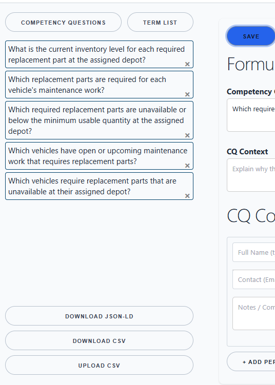
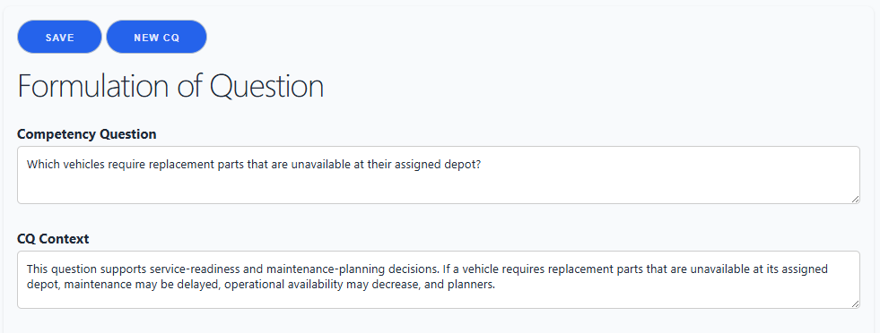
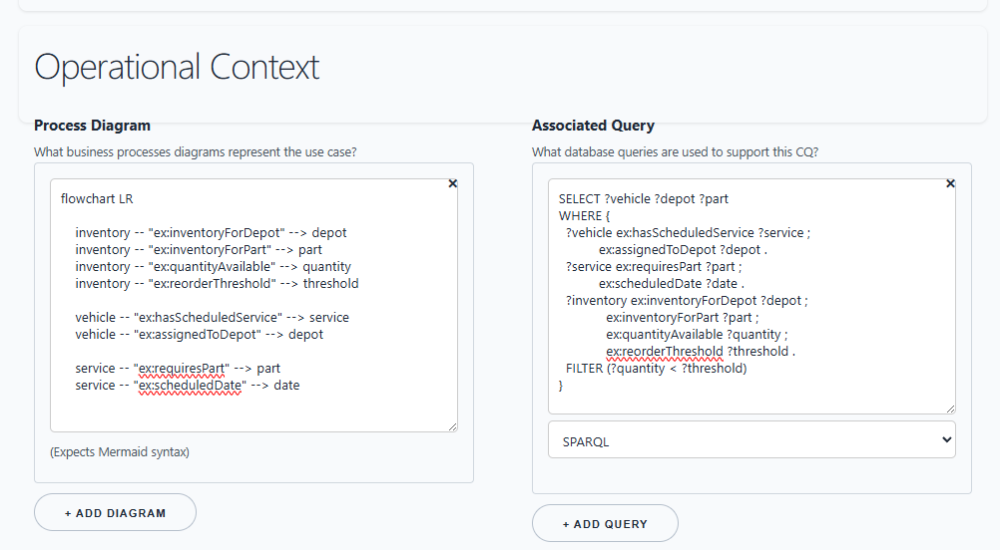
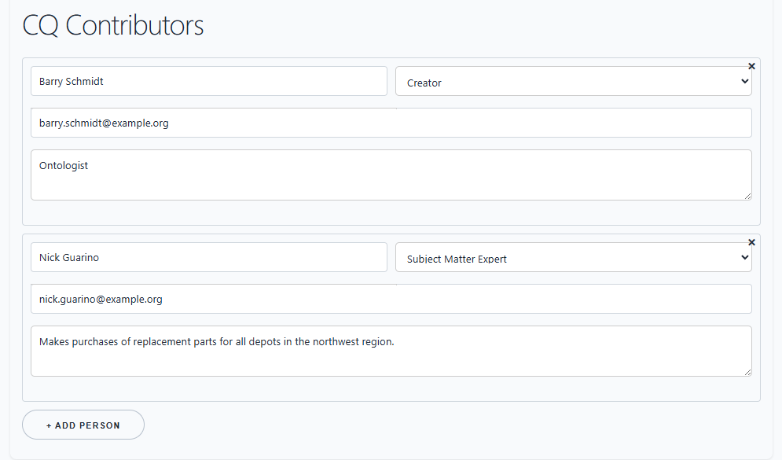
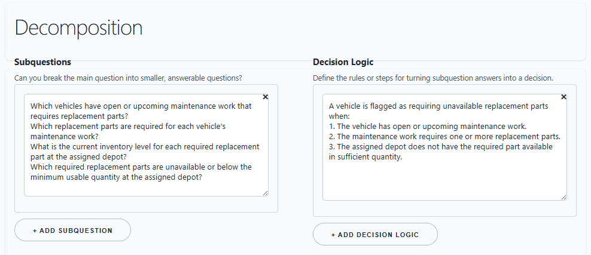
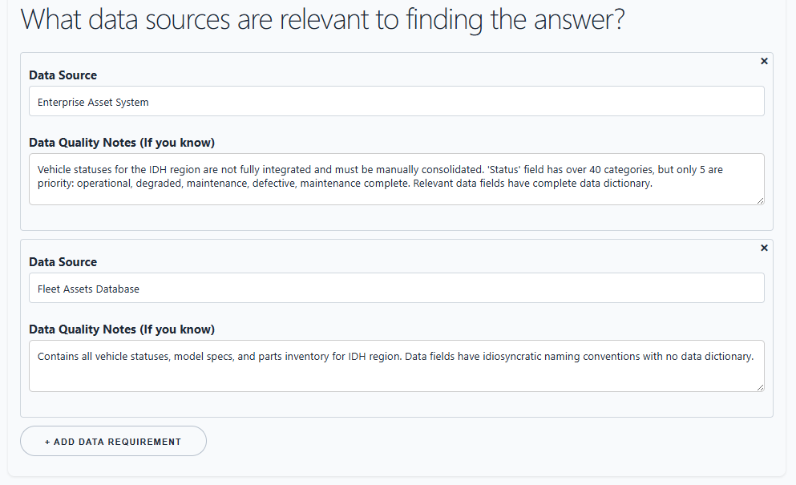
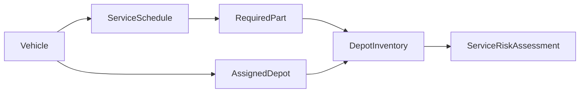
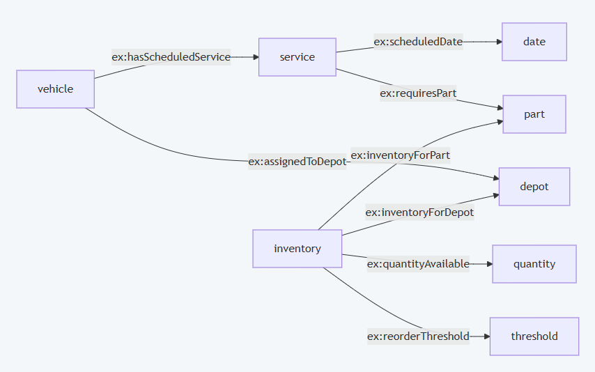
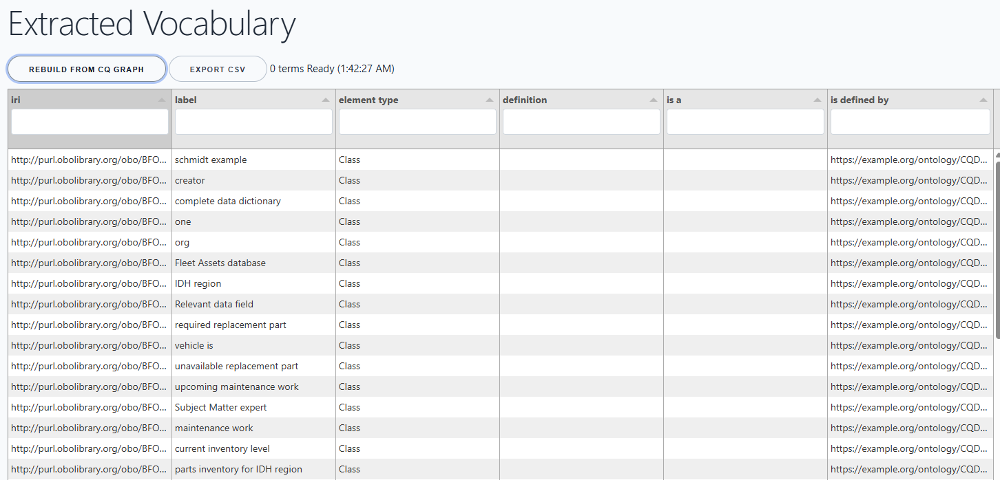
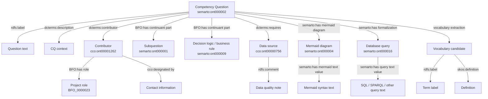

# CQ Ferret Tutorial: Turning Competency Questions into Project Intelligence

## BLUF

CQ Ferret helps ontology and knowledge-graph teams move competency questions out of Word, PowerPoint, and one-off spreadsheets and into a structured browser workspace. The payoff is practical: you can gather the question, its decomposition, contributors, data sources, diagrams, and SQL/SPARQL query ideas in one place; export normalized CSV or JSON-LD; rebuild vocabulary candidates; and load the resulting graph into downstream tooling.

This tutorial focuses only on two static pages:

- `cq-ferret.html`: the competency-question workspace.
- `vocabulary.html`: the extracted vocabulary review and export page.

Both pages run as static web pages, use JavaScript from `docs/app`, and store their working data locally in IndexedDB. CQ Ferret's native data model is aligned with BFO, Common Core Ontologies, and the small knowledge-engineering artifact ontology shipped with this project.

## Table of Contents

1. [The Problem CQ Ferret Solves](#the-problem-cq-ferret-solves)
2. [Worked Scenario](#worked-scenario)
3. [Open the App](#open-the-app)
4. [Create or Import Competency Questions](#create-or-import-competency-questions)
5. [Add Contributors and Roles](#add-contributors-and-roles)
6. [Decompose the Question](#decompose-the-question)
7. [Attach Data Sources and Data Quality Notes](#attach-data-sources-and-data-quality-notes)
8. [Attach Mermaid Diagrams](#attach-mermaid-diagrams)
9. [Attach SQL or SPARQL Query Ideas](#attach-sql-or-sparql-query-ideas)
10. [Rebuild and Export Vocabulary](#rebuild-and-export-vocabulary)
11. [Export JSON-LD and Query the Graph](#export-json-ld-and-query-the-graph)
12. [Design Pattern Notes](#design-pattern-notes)
13. [Screenshot Checklist](#screenshot-checklist)
14. [Frequently Asked Questions](#frequently-asked-questions)

## The Problem CQ Ferret Solves

In ontology-development projects, competency questions often start as meeting notes, tables, slides, or ad hoc requirements text. That is useful for early discussion, but the project soon needs more than a sentence. The team needs to know:

- Who asked or approved the question?
- What role does that person play?
- What datasets, data fields, systems, or information sources are needed to answer it?
- What data quality issues or provenance concerns are already known?
- Which AS-IS or TO-BE business-process diagrams, entity-relation diagrams, semantic design patterns, SQL queries, SPARQL queries, or NoSQL query ideas support it?
- Which vocabulary terms are implied by the wording of the questions?

Word and PowerPoint make this information readable, but hard to query. Excel can make it tabular, but each project tends to invent its own sheet structure. CQ Ferret gives the team a browser form that normalizes the inputs and makes the data exportable.

> Design note: A competency question is not merely a sentence in a document. In the application ontology used here, a competency question is an interrogative information content entity: a question-like content item used to evaluate whether a model, vocabulary, data system, or query capability has enough coverage to answer something that matters.

## Worked Scenario

This tutorial uses a fleet maintenance and service-readiness scenario. It is intentionally ordinary: many industries need to integrate data across maintenance systems, ERP systems, telematics, procurement systems, asset registers, and work-order platforms.

The use-case data is about vehicles, work orders, parts, depots, vendors, mileage, and downtime. The CQ Ferret data is about the project work: competency questions, contributors, data sources, diagrams, query notes, and extracted vocabulary.

The running question is:

> Which vehicles are at risk of missing scheduled service because required parts are unavailable at their assigned depot?

That question can be asked by a logistics planner, reviewed by a data steward, modeled by an ontologist, supported by a database engineer, and validated by subject matter experts.

## Open the App

Open `docs/cq-ferret.html` in a browser. The app runs locally as a static page. Data is saved in your browser's IndexedDB database named `CQDatabase`, in the object store `CQStore`.

The page has a left panel for the list of CQs and import/export actions. The main panel has the editing form for the selected question.



## Create or Import Competency Questions

You can start in either direction:

- Create a new CQ manually in the form.
- Import a normalized CSV file.
- Import JSON-LD if your workflow has already generated graph data.

For a hands-on start, use the sample CSV in this folder:

```text
src/tutorials/sample-cq-ferret-import.csv
```

On `cq-ferret.html`, choose **Upload CSV** and select that file. The app will add new records or update matching records if the IDs already exist.

The normalized CQ CSV is row-oriented. A CQ appears once as a row group identified by `cq_id`. Each associated artifact is a typed row using `item_type`, such as `Contributor`, `Subquestion`, `DecisionLogic`, `DataSource`, `MermaidDiagram`, or `DatabaseQuery`.



The operational context section can hold supporting technical artifacts for the CQ, including Mermaid syntax and notional SQL or SPARQL query text.



## Add Contributors and Roles

In the **CQ Contributors** section, add people who created, reviewed, approved, or need to validate the question. Record a contact method and notes about their responsibility.



For the worked scenario:

- The fleet operations planner is the subject matter expert.
- The data steward identifies authoritative systems and data quality issues.
- The ontology engineer checks the model coverage.
- The database engineer drafts query patterns.

This matters because the CQ is not just a requirement. It becomes a coordination point for several roles in the development cycle.

## Decompose the Question

Use the **Decomposition** section to break the main question into smaller answerable questions.

For the fleet maintenance scenario:

- Which vehicles have scheduled service due within the planning window?
- Which parts are required for the scheduled service type?
- Which depots are assigned to those vehicles?
- Which required parts are unavailable at those depots?
- Which vehicles have no substitute depot or vendor within the delivery threshold?

Decision logic can then capture how the answers combine:

```text
A vehicle is at service-risk when service is due within 14 days, at least one required part is below reorder threshold at the assigned depot, and no alternate source can deliver before the service date.
```



## Attach Data Sources and Data Quality Notes

Use **What data sources are relevant to finding the answer?** to list systems, datasets, files, or data products needed to answer the CQ.



Examples:

- Fleet Maintenance CMMS
- ERP Parts Inventory
- Telematics Mileage Feed
- Depot Assignment Register
- Procurement Vendor Lead-Time Table

Add data quality notes while the context is fresh. These notes are often where the real project risk appears: stale mileage, missing depot assignments, part-number mismatches, duplicate vendor records, or uncertain provenance.

This is the developer's obvious concern: it is not enough to collect the question. The team needs to know whether the data needed to answer it is actually present, trusted, timely, and joinable across systems.

## Attach Mermaid Diagrams

Use the Mermaid diagram area to associate a visual model with the CQ. This can be an AS-IS process, a TO-BE process, a database entity-relationship sketch, or a semantic design pattern.

Example Mermaid text:



This allows the diagramming work to stay attached to the question it is meant to support. A developer can draft the diagram, a domain expert can validate it, and an ontologist can use it as evidence for model coverage.

The rendered Mermaid view gives reviewers a fast way to inspect the diagram implied by the text captured in the operational context section.



## Attach SQL or SPARQL Query Ideas

Use the query area to associate known, notional, or partial query logic with the CQ. The query does not have to be final. It can be a hypothesis about how the information-retrieval process might work.

Example SQL sketch:

```sql
SELECT vehicle_id, depot_id, part_id
FROM service_due_view
JOIN service_parts USING (service_type)
JOIN depot_inventory USING (depot_id, part_id)
WHERE service_due_date <= CURRENT_DATE + INTERVAL '14 days'
  AND quantity_available < reorder_threshold;
```

Example SPARQL sketch:

```sparql
SELECT ?vehicle ?depot ?part
WHERE {
  ?vehicle ex:hasScheduledService ?service ;
           ex:assignedToDepot ?depot .
  ?service ex:requiresPart ?part ;
           ex:scheduledDate ?date .
  ?inventory ex:inventoryForDepot ?depot ;
             ex:inventoryForPart ?part ;
             ex:quantityAvailable ?quantity ;
             ex:reorderThreshold ?threshold .
  FILTER (?quantity < ?threshold)
}
```

## Rebuild and Export Vocabulary

Open `docs/vocabulary.html` after you have CQ data in the browser. Choose **Rebuild from CQ graph**. The vocabulary page reads the CQ graph from IndexedDB, extracts key terms from text-bearing fields, and displays an editable table.

The vocabulary table supports:

- `iri`
- `label`
- `type`
- `definition`
- `is a`
- `is defined by`

You can edit candidate terms, add definitions, classify them as OWL classes or properties, and export the visible table as CSV. The sample vocabulary export in this folder is:

```text
src/tutorials/sample-vocabulary-export.csv
```



This gives vocabulary stewards a bridge from CQ wording to controlled vocabulary work. It also gives downstream tools a normalized CSV that can be used in the next stage of the ontology-development cycle.

## Export JSON-LD and Query the Graph

On `cq-ferret.html`, choose **Download JSON-LD** to export the current CQ graph. The JSON-LD export can be loaded into an RDF graph database or graph-processing tool.

Once the graph is loaded, SPARQL can answer project-status questions, such as:

- What datasets have been identified across all CQs?
- Which competency questions rely on a given dataset?
- Across all CQs, who are the users of a given dataset?
- Which CQs are supported by at least one Mermaid diagram and at least one SPARQL query?

Example query: all datasets or data sources identified across all CQs.

```sparql
PREFIX rdf: <http://www.w3.org/1999/02/22-rdf-syntax-ns#>
PREFIX rdfs: <http://www.w3.org/2000/01/rdf-schema#>
PREFIX dcterms: <http://purl.org/dc/terms/>
PREFIX cco: <https://www.commoncoreontologies.org/>
PREFIX semarto: <https://github.com/jonathanvajda/SemanticArtifactOntology/>

SELECT DISTINCT ?cq ?cqLabel ?dataset ?datasetLabel ?qualityNote
WHERE {
  ?cq rdf:type semarto:ont000002 ;
      rdfs:label ?cqLabel ;
      dcterms:requires ?dataset .

  ?dataset rdf:type cco:ont00000756 ;
           cco:ont00001761 ?datasetLabel .

  OPTIONAL { ?dataset rdfs:comment ?qualityNote . }
}
ORDER BY ?datasetLabel ?cqLabel
```

> IRI note: The current CQ Ferret JavaScript uses `https://github.com/jonathanvajda/SemanticArtifactOntology/` for the CQ Ferret artifact terms. The ontology file shown with this tutorial uses the newer `https://github.com/jonathanvajda/okea/` base. If the app IRIs are migrated, update the `semarto:` prefix in this query to the new application-ontology base and keep the local names aligned.

## Design Pattern Notes

BFO is published as ISO/IEC 21838-2:2021 by ISO, where it is described as a top-level ontology supporting information interchange among heterogeneous information systems: <https://www.iso.org/standard/74572.html>.

The University at Buffalo also reports that BFO and CCO were adopted as baseline standards for formal ontology work in the U.S. Department of Defense and Intelligence Community: <https://www.buffalo.edu/cas/philosophy/news-events/news/smith-top-level-ontologies.html>.

CQ Ferret follows that spirit at the application level: it treats questions, diagrams, queries, contributors, roles, data sources, and extracted vocabulary items as typed information artifacts that can be exported and queried.



The important pattern is simple: every CQ becomes a small hub. Around it, the team attaches the evidence needed to decide whether the model and data environment can answer the question.

## Screenshot Checklist

Use this as the working checklist for tutorial screenshot coverage.

| Tutorial need | Screenshot file | Covered? | Notes |
| --- | --- | --- | --- |
| CQ list showing multiple competency questions | `screenshots/cq-list.png` | Yes | Inserted in [Open the App](#open-the-app). |
| CQ upload and download/export buttons | `screenshots/cq-list.png` | Yes | Covered by the CQ list screenshot; buttons are visible without a callout. |
| Question formulation | `screenshots/formulation-of-question.png` | Yes | Inserted in [Create or Import Competency Questions](#create-or-import-competency-questions). |
| Question context / operational context | `screenshots/cq-operational-context.png` | Yes | Inserted in [Create or Import Competency Questions](#create-or-import-competency-questions). |
| Contributor section with name, role, contact, and notes | `screenshots/cq-contributors.png` | Yes | Inserted in [Add Contributors and Roles](#add-contributors-and-roles). |
| CQ decomposition: subquestions and decision logic | `screenshots/decomposition-of-question.png` | Yes | Inserted in [Decompose the Question](#decompose-the-question). |
| Data sources and data quality notes | `screenshots/relevant-data-sources.png` | Yes | Inserted in [Attach Data Sources and Data Quality Notes](#attach-data-sources-and-data-quality-notes). |
| Mermaid syntax area | `screenshots/cq-operational-context.png` | Yes | Covered by the operational context screenshot. |
| Rendered Mermaid diagram | `screenshots/mermaid-diagram.png` | Yes | Inserted in [Attach Mermaid Diagrams](#attach-mermaid-diagrams). |
| Query area with SQL or SPARQL attached to the CQ | `screenshots/cq-operational-context.png` | Yes | Covered by the operational context screenshot. |
| Vocabulary table after rebuild | `screenshots/vocabulary-list.png` | Yes | Inserted in [Rebuild and Export Vocabulary](#rebuild-and-export-vocabulary). |
| Vocabulary rebuild and export actions | `screenshots/vocabulary-list.png` | Yes | Covered by the vocabulary list screenshot; buttons are visible without a callout. |

## Frequently Asked Questions

### Why use competency questions instead of just collecting terms?

Terms without questions are hard to prioritize. A competency question explains why a term matters by connecting it to an information need, a decision, a data source, or a query.

### Is CQ Ferret a replacement for ontology editing tools?

No. It is a requirements and knowledge-engineering capture tool. It helps organize the questions, supporting data, diagrams, query ideas, and vocabulary candidates that later inform ontology editing.

### Can multiple people work from the same CQ set?

Yes, by exchanging normalized CSV or JSON-LD exports. CQ Ferret itself is local-browser based, so teams should agree on a project file exchange pattern or repository workflow.

### What should I do when the extracted vocabulary has weak or noisy terms?

Treat extraction as a starting point, not an authority. Review labels, remove noise, add definitions, assign OWL element types, and export only the terms that are useful for the next modeling step.

### What is the difference between CQ data and use-case data?

CQ data is project metadata: questions, contributors, diagrams, query text, data source references, and vocabulary candidates. Use-case data is the operational domain data, such as vehicles, patients, products, orders, facilities, parts, or work orders.

### Why use a browser app with IndexedDB?

It keeps the workflow lightweight. A project team can collect structured data in a static website without standing up a server. Exports can then move the data into other systems.

### Why export JSON-LD?

JSON-LD preserves graph structure. After export, the CQ graph can be loaded into a graph database and queried with SPARQL to find gaps, overlaps, dependencies, and evidence across many CQs.

### Why export CSV?

CSV is easy to inspect, move, and normalize. It is useful for review, issue tracking, spreadsheet workflows, and import into tools that expect tabular vocabulary or requirements data.
