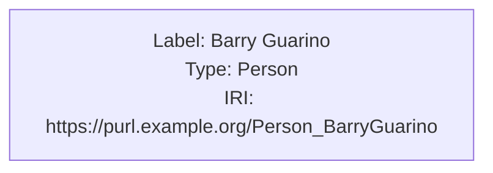
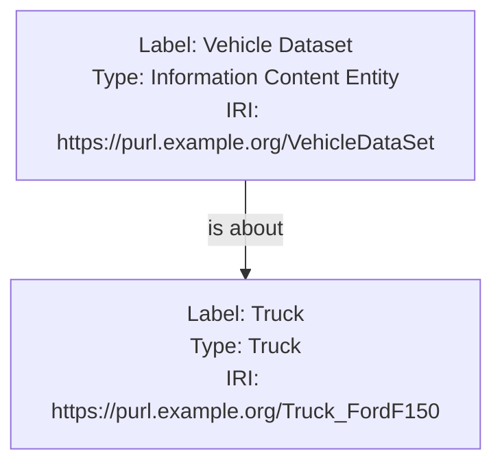
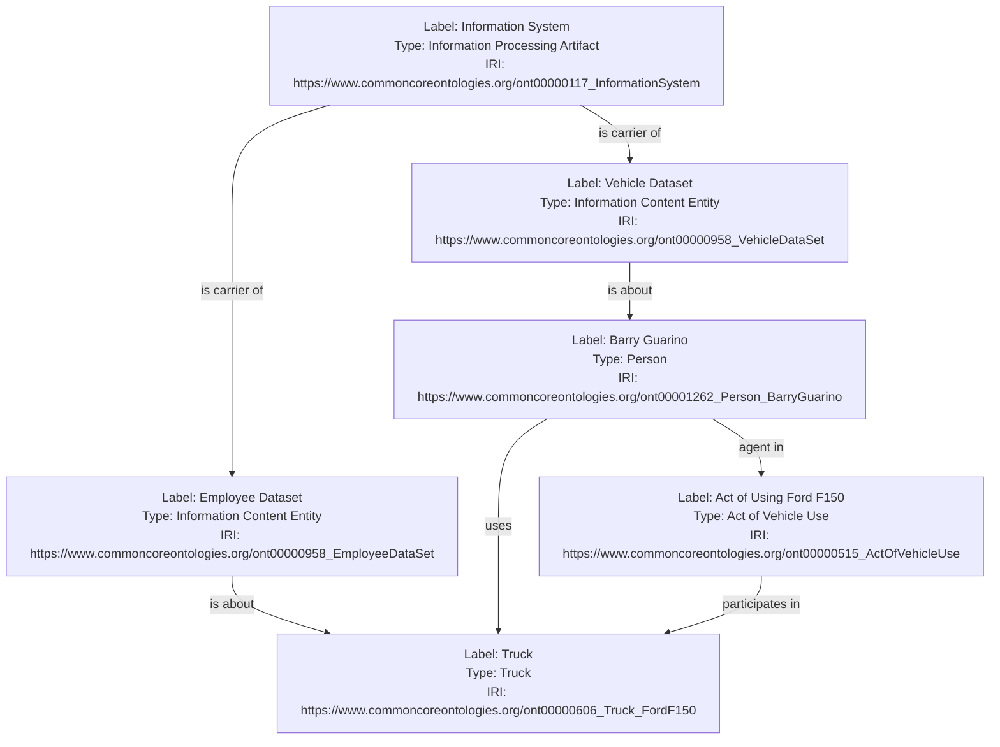
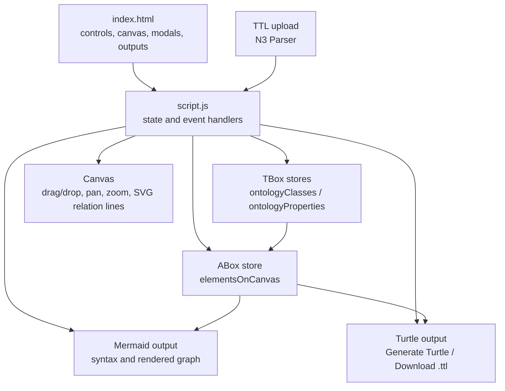

# Knowledge Graph Modeler Tutorial: Draw ABox Assertions and Export RDF

## BLUF

The [RDF Knowledge Graph Modeler](https://skreen5hot.github.io/kgModeler/) is a browser app for drawing small knowledge graphs. If you have used Lucidchart, PowerPoint, Visio, or draw.io, think of this as a diagramming tool where the boxes and arrows can also become RDF data.

Use it to:

- Add boxes for real things, such as people, vehicles, datasets, systems, or events.
- Choose what kind of thing each box is.
- Draw arrows between boxes.
- Choose what each arrow means.
- Generate a Mermaid diagram.
- Export the graph as Turtle (`.ttl`) when you want RDF data.

The app does not save projects in the browser yet. Treat export as the save button: download Turtle or copy the Mermaid text before leaving the page.

The tool is free, open source, and released under CC0 1.0; no account signup is needed, and the app does not get or sell your data.

This tutorial focuses on using the deployed app at <https://skreen5hot.github.io/kgModeler/>. Developer notes and source-file details are collected near the end.

## Table of Contents

1. [The Problem This App Solves](#the-problem-this-app-solves)
2. [Open the App](#open-the-app)
3. [Understand the Workspace](#understand-the-workspace)
4. [Load or Create an Ontology Vocabulary](#load-or-create-an-ontology-vocabulary)
5. [Create Instances on the Canvas](#create-instances-on-the-canvas)
6. [Draw Semantic Relations](#draw-semantic-relations)
7. [Review Mermaid Output](#review-mermaid-output)
8. [Generate and Download Turtle](#generate-and-download-turtle)
9. [Worked Scenario: Vehicle Use and Datasets](#worked-scenario-vehicle-use-and-datasets)
10. [Example Turtle Import](#example-turtle-import)
11. [Export and Persistence Notes](#export-and-persistence-notes)
12. [Architecture Notes](#architecture-notes)
13. [Frequently Asked Questions](#frequently-asked-questions)

## The Problem This App Solves

Knowledge graph work often starts with a plain-language example:

- A person uses a truck.
- A vehicle dataset is about that truck.
- An employee dataset is about that person.
- An information system is the carrier of those datasets.
- An act of vehicle use has the person as agent and the truck as participant.

Those statements are easy to discuss in a meeting, but they can be harder to turn into a clean data model. The Knowledge Graph Modeler helps with the middle step. You draw the example as boxes and arrows, then let the app produce Mermaid and Turtle output.

The app helps a team check simple questions:

- What things are in the example?
- What kind of thing is each one?
- Which things are connected?
- What does each connection mean?
- Does the exported data match the picture?

## Open the App

Open the deployed app in a browser:

```text
https://skreen5hot.github.io/kgModeler/
```

The visible page title is **RDF Knowledge Graph Modeler**.

## Understand the Workspace

The screen has four main areas:

| Region | Purpose |
| --- | --- |
| Toolbox | Drag a new **Instance** onto the canvas, upload a `.ttl` file, or clear the workspace. |
| Ontology sidebar | Add the kinds of things and kinds of relationships you want to use. |
| Canvas | Arrange boxes and draw arrows between them. |
| Output panels | See Mermaid text, a Mermaid preview, and Turtle output. |

Because the app does not save a project file yet, refreshes clear unsaved work. Export before leaving the page.

## Load or Create an Ontology Vocabulary

Before drawing, add the vocabulary you want to use.

In plain terms:

- A **class** is a kind of thing, such as `Person`, `Truck`, or `Dataset`.
- An **object property** is a kind of relationship, such as `uses`, `is about`, or `is carrier of`.

There are two ways to populate the Ontology sidebar.

### Upload Turtle

Choose **Upload .ttl file** and select a Turtle file. The app reads class and relationship options from the file.

Uploading a Turtle file clears the current canvas and vocabulary after confirmation. In the current app, upload is mainly for loading the menu choices. It does not rebuild a saved diagram layout.

### Create Classes and Properties Manually

Use the **+** buttons in the Ontology sidebar when you want to type the choices yourself.

For a class:

1. Choose **+** beside **Classes**.
2. Enter a label, such as `Person`.
3. Enter a base IRI, such as `https://purl.example.org/`.
4. Enter a short prefix, such as `ex`.
5. Enter or accept an IRI ending, such as `Person`.
6. Save.

For an object property:

1. Choose **+** beside **Object Properties**.
2. Enter a label, such as `is about`.
3. Enter the same base IRI and prefix if appropriate.
4. Enter an IRI ending, such as `isAbout`.
5. Save.

The IRI fields make the export more precise. If you are new to IRIs, start with the examples in this tutorial and keep the same base IRI and prefix for all items.

## Create Instances on the Canvas

1. Drag **Instance** from the Toolbox onto the canvas.
2. In the **Edit Instance** modal, set:
   - **Label**
   - **IRI**
   - **Type (Class)**
3. Choose **Save**.
4. Repeat for the individuals in your example.

Each instance appears as a movable card. The card shows the label, type, and IRI. You can drag cards to arrange the graph, use the mouse wheel to zoom, and drag the canvas background to pan.

The Mermaid output updates automatically. A box will look roughly like this in the generated Mermaid text:



## Draw Semantic Relations

Relations are arrows between boxes.

1. Find the small connector dot on the right side of a source instance.
2. Drag from that connector to the target instance.
3. Release over the target instance.
4. Click the relation line.
5. In **Edit Connection Property**, choose an object property.
6. Save the connection.

After the arrow exists, click the line to edit it:

| Action | Use |
| --- | --- |
| Save Connection | Assign or update the relationship. |
| Reverse Direction | Move the assertion from `A -> B` to `B -> A`. |
| Delete Relation | Remove the object-property assertion. |

Direction matters. If the intended statement is:

```text
Vehicle Dataset -> is about -> Truck
```

then start the arrow at the vehicle dataset and end it at the truck.

## Review Mermaid Output

The app automatically generates Mermaid syntax whenever boxes or arrows change. It also renders that syntax in the Mermaid output panel.

Generated Mermaid is useful for:

- Documentation.
- MkDocs tutorials.
- Pull request discussion.
- Design review.
- Checking arrow direction before export.

For example, a relation from `rdfInstance2` to `rdfInstance5` with predicate label `is about` becomes:



## Generate and Download Turtle

Choose **Generate Turtle** after the canvas has the boxes and arrows you want. The app fills the Turtle output box with RDF text.

You do not need to understand every line of Turtle to use this step. The important check is whether the labels, types, and relationships match the diagram.

Then choose **Download .ttl** to export:

```text
graph.ttl
```

This Turtle file is the main durable artifact for the model. It can be loaded into RDF tools later or kept with project notes.

## Worked Scenario: Vehicle Use and Datasets

This scenario models a small set of information artifacts and domain entities:

- An information system carries two datasets.
- One dataset is about a truck.
- One dataset is about a person.
- The person uses the truck.
- The person is agent in an act of vehicle use.
- The act of vehicle use participates in the truck.

Create these classes:

| Label | Suggested suffix |
| --- | --- |
| Information Processing Artifact | `InformationProcessingArtifact` |
| Information Content Entity | `InformationContentEntity` |
| Person | `Person` |
| Truck | `Truck` |
| Act of Vehicle Use | `ActOfVehicleUse` |

Create these object properties:

| Label | Suggested suffix |
| --- | --- |
| is carrier of | `isCarrierOf` |
| is about | `isAbout` |
| uses | `uses` |
| agent in | `agentIn` |
| participates in | `participatesIn` |

Use this base IRI and prefix for the example:

```text
Base IRI: https://purl.example.org/
Prefix: ex
```

Create these instances:

| Label | Type | Suggested IRI suffix |
| --- | --- | --- |
| Information System | Information Processing Artifact | `ont00000053_InformationSystem` |
| Vehicle Dataset | Information Content Entity | `ont00000057_VehicleDataSet` |
| Employee Dataset | Information Content Entity | `ont00000057_EmployeeDataSet` |
| Barry Guarino | Person | `ont00001262_Person_BarryGuarino` |
| Truck | Truck | `ont00001262_Truck_FordF150` |
| Act of Using Ford F150 | Act of Vehicle Use | `ont00001262_ActOfVehicleUse` |

Draw these relations:

| Source | Predicate | Target |
| --- | --- | --- |
| Information System | is carrier of | Employee Dataset |
| Information System | is carrier of | Vehicle Dataset |
| Vehicle Dataset | is about | Truck |
| Employee Dataset | is about | Barry Guarino |
| Barry Guarino | uses | Truck |
| Barry Guarino | agent in | Act of Using Ford F150 |
| Act of Using Ford F150 | participates in | Truck |

The generated Mermaid should resemble:



Review the Mermaid first, then generate Turtle and inspect the RDF triples.

## Example Turtle Import

Use this small Turtle file if you want to preload the class and property options before drawing instances:

```turtle
@prefix cco2: <https://www.commoncoreontologies.org/> .
@prefix obo: <http://purl.obolibrary.org/obo/> .
@prefix owl: <http://www.w3.org/2002/07/owl#> .
@prefix rdf: <http://www.w3.org/1999/02/22-rdf-syntax-ns#> .
@prefix rdfs: <http://www.w3.org/2000/01/rdf-schema#> .

cco2:ont00000117 rdf:type owl:Class ;
                 rdfs:label "Information Processing Artifact"@en .

cco2:ont00000958 rdf:type owl:Class ;
                 rdfs:label "Information Content Entity"@en .

cco2:ont00001262 rdf:type owl:Class ;
                 rdfs:label "Person"@en .

cco2:ont00000606 rdf:type owl:Class ;
                 rdfs:label "Truck"@en .

cco2:ont00000515 rdf:type owl:Class ;
                 rdfs:label "Act of Vehicle Use"@en .

obo:BFO_0000101 rdf:type owl:ObjectProperty ;
                rdfs:label "is carrier of"@en .

cco2:ont00001808 rdf:type owl:ObjectProperty ;
                 rdfs:label "is about"@en .

cco2:ont00001813 rdf:type owl:ObjectProperty ;
                 rdfs:label "uses"@en .

cco2:ont00001787 rdf:type owl:ObjectProperty ;
                 rdfs:label "agent in"@en .

obo:BFO_0000056 rdf:type owl:ObjectProperty ;
                rdfs:label "participates in"@en .
```

After uploading this file, the canvas remains empty. Drag instances onto the canvas and select the imported classes and object properties from the modals.

## Export and Persistence Notes

The current app is export-oriented rather than project-oriented.

| Need | Current path |
| --- | --- |
| Save RDF | Generate Turtle, then download `graph.ttl`. |
| Save diagram source | Copy the generated Mermaid syntax from the Mermaid output panel. |
| Save rendered diagram | Use Mermaid source as the durable artifact, then render it in MkDocs, GitHub, or another Mermaid-capable tool. |
| Save editable canvas state | Not currently available. Rebuild from exported Turtle and manual layout if needed. |
| Persist in browser | Not currently available. IndexedDB support may be added later. |

Because canvas layout is not exported as a project file yet, keep modeling sessions focused and export often.

## Architecture Notes

For developers, the source repository is:

```text
https://github.com/skreen5hot/kgModeler
```

### Local Development

For normal tutorial use, you can skip local setup. Use the deployed app.

For local development or offline review, serve the `kgModeler` folder with a local static server, then open the local URL. The deployed site is the recommended path for ordinary tutorial use.

The main implementation files are:

| File | Role |
| --- | --- |
| `index.html` | Static page, controls, modals, canvas, and output areas. |
| `script.js` | Ontology loading, TBox editing, drag/drop instances, relation editing, Mermaid generation, and Turtle generation. |
| `styles.css` | Layout, canvas, sidebar, modal, and output styling. |

The page loads two browser libraries from CDNs:

| Library | Use |
| --- | --- |
| N3.js | Parse uploaded Turtle and support RDF/Turtle work. |
| Mermaid.js | Render the generated Mermaid graph. |

The app uses three main in-memory data stores:

| Store | Meaning |
| --- | --- |
| `ontologyClasses` | Class options, each with label and IRI. |
| `ontologyProperties` | Object-property options, each with label and IRI. |
| `elementsOnCanvas` | Instances, coordinates, labels, IRIs, selected class, and outgoing connections. |

The app is a single static page with event-driven JavaScript.



Important implementation details:

- Mermaid is initialized with `securityLevel: 'loose'`.
- Turtle import uses the N3 parser.
- The app ignores blank-node subjects when loading Turtle.
- Relation lines are SVG paths with wider transparent hitboxes for editing.
- Turtle generation includes used classes and properties, not the entire uploaded ontology.
- The download file name is currently `graph.ttl`.

## Frequently Asked Questions

### Is this an ontology editor?

No. It is a lightweight model sketcher for TBox options and ABox assertions. Use an ontology editor or source repository for authoritative ontology release work.

### Does uploading Turtle load instance diagrams?

No. The current Turtle import is primarily for populating classes, object properties, labels, and prefixes. It clears the workspace and leaves the canvas empty for new visual modeling.

### Where is my work saved?

Only in browser memory until you export. Download Turtle or copy Mermaid syntax before refreshing, closing the tab, or clearing the canvas.

### Is the app free and open source?

Yes. The repository owner has adopted the [CC0 1.0 Universal license](https://creativecommons.org/publicdomain/zero/1.0/) for this tool, which means it is intended to be freely reusable with no account signup or license fee.

The deployed app is a static web page. It works in your browser and does not provide a backend account or project database, so there is no app service receiving your model to sell it.

### What does the Turtle export include?

It includes default and custom prefixes, object properties used by connections, classes used by instances, and instance data with type, label, and object-property assertions.

### Can I use this with OntoEagle tutorials?

Yes. Copy the generated Mermaid syntax into a fenced `mermaid` block, or download Turtle and use it as a sample graph artifact for later RDF review.
