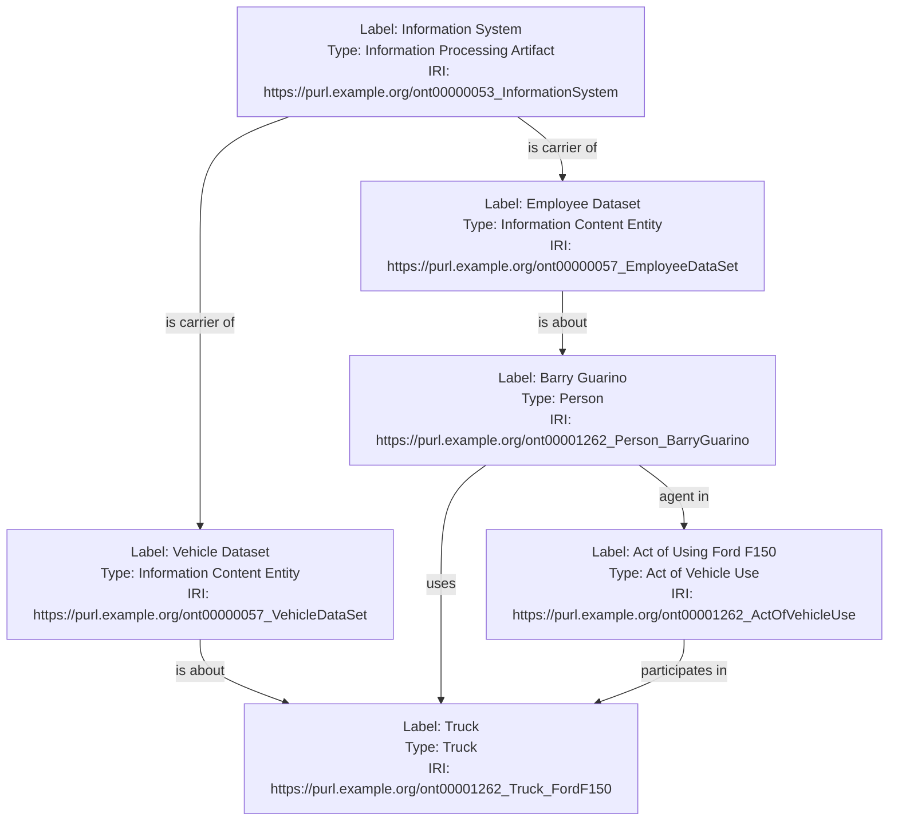
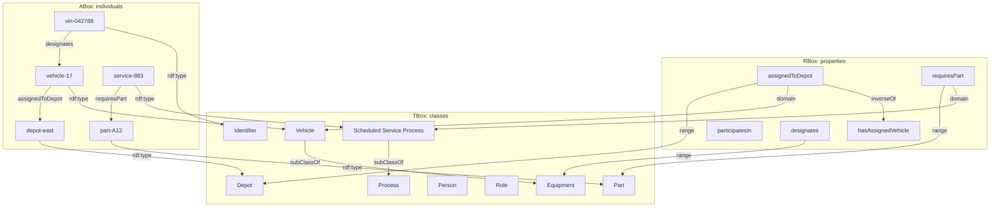
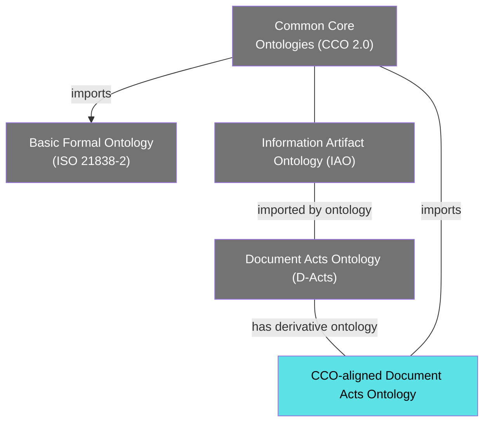
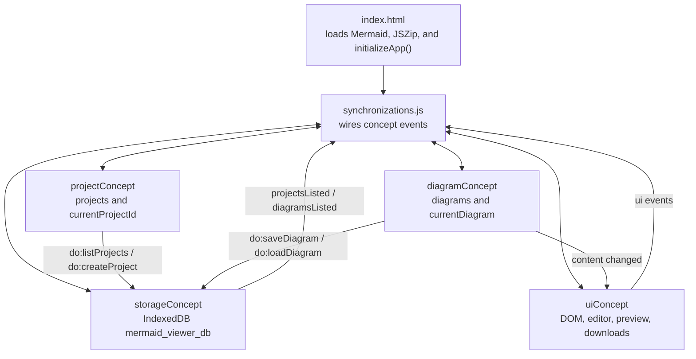

# Mermaid Project IDE Tutorial: Build Local Diagram Projects for Semantic Design Patterns

## BLUF

The [Mermaid Project IDE](https://skreen5hot.github.io/mermaid/) is a lightweight browser workspace for creating, previewing, organizing, importing, and exporting Mermaid diagrams. It is useful when ontology and knowledge-graph teams need a fast place to sketch semantic design patterns, ABox instance graphs, RBox property relationships, TBox class structures, ontology imports, process patterns, equipment relationships, identifier schemes, and review diagrams.

The application stores projects and diagrams in the browser with IndexedDB, so the working data stays local to the user's browser origin. It is not a cloud repository and it does not require a server-side database. Teams can collaborate by exporting individual `.mmd` files or whole project `.zip` bundles and committing those artifacts to Git, attaching them to tickets, or exchanging them during model review.

This tutorial focuses on the deployed app at <https://skreen5hot.github.io/mermaid/>. For developers who want to inspect or modify the implementation, the local `./mermaid` source files define the app behavior:

- `index.html`: the browser entry point and application shell.
- `src/synchronizations.js`: the event wiring between independent concepts.
- `src/concepts/projectConcept.js`: project list and current-project state.
- `src/concepts/diagramConcept.js`: diagram list, current diagram, saving, deletion, renaming, and `.mmd` export.
- `src/concepts/storageConcept.js`: IndexedDB persistence for projects and diagrams.
- `src/concepts/uiConcept.js`: DOM rendering, split view, Mermaid rendering, downloads, thumbnails, modals, and button state.

## Table of Contents

1. [The Problem This App Solves](#the-problem-this-app-solves)
2. [Run the App](#run-the-app)
3. [Understand the Workspace](#understand-the-workspace)
4. [Create a Project](#create-a-project)
5. [Create and Preview a Diagram](#create-and-preview-a-diagram)
6. [Use Split View for Realtime Review](#use-split-view-for-realtime-review)
7. [Manage Diagrams in a Project](#manage-diagrams-in-a-project)
8. [Import and Export Artifacts](#import-and-export-artifacts)
9. [Worked Scenario: Fleet Readiness Semantic Pattern](#worked-scenario-fleet-readiness-semantic-pattern)
10. [Example: Instance Relations, ABox and RBox](#example-instance-relations-abox-and-rbox)
11. [Example: TBox, ABox, and RBox Assertions](#example-tbox-abox-and-rbox-assertions)
12. [Example: Ontology Imports](#example-ontology-imports)
13. [Architecture Notes](#architecture-notes)
14. [Testing and Security Notes](#testing-and-security-notes)
15. [Frequently Asked Questions](#frequently-asked-questions)

## The Problem This App Solves

Ontology-development projects often need diagrams before the formal model is finished. A team may need to show how persons participate in processes, how equipment bears identifiers, how organizations own assets, how information artifacts designate entities, or how one ontology imports another. Those diagrams are often drafted in notes, slides, chat threads, or one-off Mermaid snippets.

The Mermaid Project IDE gives those snippets a stable local workspace:

- Projects group related diagrams.
- Diagrams are stored as named Mermaid source files.
- The editor and preview can be shown side by side.
- Diagrams can be exported individually as `.mmd`.
- A project can be exported as a `.zip` containing all diagrams.
- Existing `.mmd` files can be uploaded in bulk.
- Browser-local IndexedDB persistence preserves work between sessions.

The design goal is practical: keep diagram drafting close to semantic modeling work without forcing a heavyweight ontology editor into every early conversation.

## Run the App

Open the deployed app in a browser:

```text
https://skreen5hot.github.io/mermaid/
```

That is the recommended starting point for tutorial use. The app runs as a static site and stores work in the browser's IndexedDB for that site origin.

For local development or offline review, run the app from a local web server instead of opening `index.html` directly from the filesystem. The app uses JavaScript modules, and browsers restrict module loading from raw filesystem URLs.

From the `./mermaid` directory:

```bash
npx serve
```

Then open the local URL shown by the command, commonly:

```text
http://localhost:3000
```

In VS Code, you can also use Live Server:

1. Open the `mermaid` folder.
2. Right-click `index.html`.
3. Choose **Open with Live Server**.

The page title is **Mermaid Syntax Viewer & Editor**, and the visible header is **Mermaid Project IDE**.

## Understand the Workspace

The app has three working regions:

| Region | Purpose |
| --- | --- |
| Project sidebar | Select, create, and delete projects; choose diagrams; upload `.mmd`; download the current project as `.zip`. |
| Code view | Edit Mermaid source, create diagrams, save, rename, delete, export `.mmd`, and enter fullscreen. |
| Diagram view | Render the active Mermaid source as SVG. |

The app starts by opening the IndexedDB database named:

```text
mermaid_viewer_db
```

It creates two object stores:

| Store | Purpose |
| --- | --- |
| `projects` | Project records with generated numeric IDs and names. |
| `diagrams` | Diagram records with generated numeric IDs, project IDs, names, content, and modification dates. |

When no projects exist, the app creates a **Default Project** and a starter diagram named `generic`.

## Create a Project

Use a project for a modeling topic, review package, ontology module, application pattern, or customer/domain use case.

1. Choose the **+** button next to the project selector.
2. Enter a project name, such as:

```text
Fleet readiness semantic patterns
```

3. Confirm the prompt.
4. The project selector switches to the newly created project.

Project examples:

- `Person and role patterns`
- `Equipment identifier patterns`
- `Maintenance process diagrams`
- `Ontology import maps`
- `Competency question diagrams`
- `TBox-ABox-RBox examples`

## Create and Preview a Diagram

1. Choose **New**.
2. Enter a diagram name, such as:

```text
vehicle-depot-instance-relations
```

3. The editor opens with default Mermaid source.
4. Replace the text with your diagram.
5. Choose **Save**.
6. Choose **Diagram** or **Render** to inspect the rendered output.

Use short, stable diagram names when the files may be exported to Git. For example:

```text
fleet-abox-rbox.mmd
fleet-tbox-abox-rbox.mmd
fleet-ontology-imports.mmd
```

## Use Split View for Realtime Review

The **Split** button shows the code editor and rendered diagram side by side. This is the most useful mode for semantic pattern work because reviewers can compare the intended assertion pattern with the actual Mermaid syntax.

In split view:

- The left pane holds the Mermaid source.
- The right pane holds the rendered diagram.
- The split-view divider can be dragged.
- Content changes are debounced and re-rendered automatically.
- Syntax errors are shown in the diagram pane instead of breaking the page.

This is especially helpful when checking relationship direction. For ontology diagrams, a reversed edge can change the meaning of the pattern.

## Manage Diagrams in a Project

The sidebar lists diagrams for the selected project. Each item includes a small thumbnail preview when Mermaid can render the source.

Common actions:

| Action | Use |
| --- | --- |
| **New** | Create a new named diagram in the current project. |
| **Save** | Persist the current Mermaid source to IndexedDB. |
| **Rename** | Change the active diagram name. |
| **Delete** | Delete the active diagram from the current project. |
| Select a sidebar item | Load another diagram into the editor and preview pane. |

Deletion is permanent within the browser-local database. Export important diagrams before clearing browser data or deleting a project.

## Import and Export Artifacts

The app supports simple file exchange.

| Artifact | Import | Export | Notes |
| --- | --- | --- | --- |
| Single Mermaid diagram | Upload `.mmd` through the sidebar | **Export .mmd** from the editor toolbar | Best for Git commits, issue attachments, or copying into Markdown docs. |
| Mermaid project bundle | Upload multiple `.mmd` files | **Download .zip** from the sidebar | Best for moving a group of related diagrams between browsers or teammates. |
| Rendered SVG | Not currently imported | Rendered in the browser, but no dedicated SVG export button yet | Use `.mmd` as the source artifact. |
| JSON-LD | Event wiring exists for a JSON-LD export action, but the current HTML does not expose a button for it | Not visible in the current UI | Treat `.mmd` and `.zip` as the supported user-facing exports. |

Uploaded `.mmd` files become diagrams in the current project. The file name, minus `.mmd`, becomes the diagram name.

## Worked Scenario: Fleet Readiness Semantic Pattern

This tutorial uses a fleet readiness scenario because it touches several common ontology-development concerns:

- Persons and roles.
- Vehicles and equipment.
- Facilities and depots.
- Processes and scheduled service.
- Parts and inventory.
- Identifier codes.
- Information artifacts that designate real-world entities.

The modeling question is:

```text
Which vehicles are at risk of missing scheduled service because required parts are unavailable at their assigned depot?
```

Create a project named:

```text
Fleet readiness semantic patterns
```

Then create three diagrams:

1. `fleet-abox-rbox`
2. `fleet-tbox-abox-rbox`
3. `fleet-ontology-imports`

The next sections provide Mermaid source for each diagram.

## Example: Instance Relations, ABox and RBox

An ABox contains assertions about individuals. An RBox contains assertions about properties and relationships. In a diagram, the most useful first pass is often an instance graph: concrete objects connected by named relationships.

Paste this into a diagram named `fleet-abox-rbox`:



Review questions:

- Are edge labels relationship names or informal English?
- Does each edge direction match the intended predicate direction?
- Are datasets represented as information content entities rather than as the vehicles or employees they describe?
- Does the information system function as a carrier for the datasets?
- Do the "is about" edges connect information content to the entities it represents?

The starting sample `graph BT;` is a valid direction declaration, but it is only a blank graph. For review work, add nodes and edges like the example above.

## Example: TBox, ABox, and RBox Assertions

A TBox contains class-level assertions. An ABox contains individual-level assertions. An RBox contains relationship-level assertions such as subproperty, inverse, domain, or range patterns.

Paste this into a diagram named `fleet-tbox-abox-rbox`:



Use this kind of diagram to check whether a semantic design pattern has enough structure to support RDF data, SPARQL queries, and inference expectations.

## Example: Ontology Imports

Ontology import diagrams show dependency structure. They are useful during release planning because imports can explain why a term is available, why a reasoner sees a relationship, or why a downstream application has a dependency on a large ontology module.

Paste this into a diagram named `fleet-ontology-imports`. This version keeps the structure and styling of the example while using Mermaid-valid node declarations:



Review questions:

- Which imports are required for reasoning and which are only used for annotation?
- Can a smaller import set support the application pattern?
- Are the imported ontologies stable enough for the release workflow?
- Does the project need an import closure diagram for build or CI review?

## Architecture Notes

The app follows a Concepts and Synchronizations architecture. Each concept owns its state and exposes actions through a `listen(event, payload)` interface. Cross-concept behavior is centralized in `src/synchronizations.js`.



This keeps the main behavior legible:

- Storage does not manipulate the DOM.
- UI does not directly write IndexedDB records.
- Project state does not directly import diagram state.
- Synchronizations make the event flow explicit.

The top-level `app.js` file currently exists but is empty. The active browser entry point is the inline module in `index.html`, which imports `initializeApp()` from `src/synchronizations.js`.

## Testing and Security Notes

The project documentation emphasizes process-isolated testing, minimal dependencies, and explicit UI behavior.

Testing guidance:

- Run the test suite from the `./mermaid` directory with the package test command.
- Test files are process-isolated so state does not leak between files.
- Concepts should be tested through their public state, actions, and emitted events.
- Synchronization tests should verify that event rules trigger the intended concept actions.
- UI tests should prefer deterministic selectors and explicit waits.

Security guidance:

- Treat diagram names and Mermaid source as user input.
- Prefer `textContent` for dynamic text in the DOM.
- When HTML insertion is required for rendered SVG or error display, keep escaping and containment behavior explicit.
- Do not store passwords, tokens, or other secrets in IndexedDB.
- Keep dependency use minimal and run `npm audit` as part of routine maintenance.

## Frequently Asked Questions

### Is the Mermaid Project IDE an ontology editor?

No. It is a diagram workspace. Use it to draft and review semantic patterns, relationship directions, import maps, process diagrams, and evidence diagrams that support ontology work.

### Where is my data stored?

Projects and diagrams are stored in IndexedDB under the browser origin where the app is served. If you run the app at a different local URL or clear browser site data, you may see a different workspace or lose local data.

### How should a team share diagrams?

Export `.mmd` files or download the project `.zip`. Commit the files to a repository, attach them to issue tickets, or include them in ontology-review packages.

### Why use split view?

Split view makes syntax and meaning visible at the same time. For semantic diagrams, this is useful because reviewers can catch reversed predicates, missing type assertions, disconnected nodes, and ambiguous relationship labels while the source is still easy to edit.

### Can I render diagrams inside OntoEagle tutorials?

Yes. OntoEagle tutorials load Mermaid support through MkDocs configuration, so fenced `mermaid` code blocks can render in the generated tutorial site.

### What should I export as the authoritative artifact?

Use `.mmd` as the authoritative source. Rendered diagrams are useful for review, but the Mermaid source is the artifact that can be diffed, versioned, edited, and regenerated.
